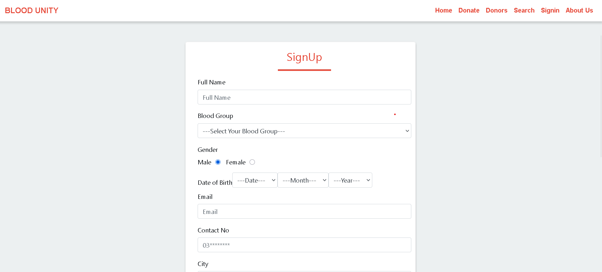

# Blood Unity

"Blood Unity" is a web-based system that can facilitate the needy person.
From this system, there are several types of functionality such as donor registration, 
requesting blood by the needy person, searching for donors by blood type, donation record and reporting.  
The system also provides information to the donor about blood donation.

## 🖼 Homepage

Only donors with the same blood type can accept blood requests by the needy person. Needy persons
can search for donors by locality and city.

## 🩸 Donate Page

Our website serves as a comprehensive resource dedicated to promoting blood donation and
supporting those who wish to contribute to this lifesaving mission.

## 👥 About Us

We aim to educate the public about the importance of blood donation, provide a seamless platform
for scheduling donations, and offer opportunities for volunteering and community involvement.

---

## 💻 Technologies Used

- Java (JSP & Servlets)
- MySQL Database
- HTML, CSS

---

## ✅ Features

- Donor registration and management  
- Blood requests based on blood type and location  
- Search and filter donors  
- Report donation records  
- Admin panel and analytics

---

The system is user-friendly, efficient, and free of major errors. It was built with future development and enhancements in mind.

